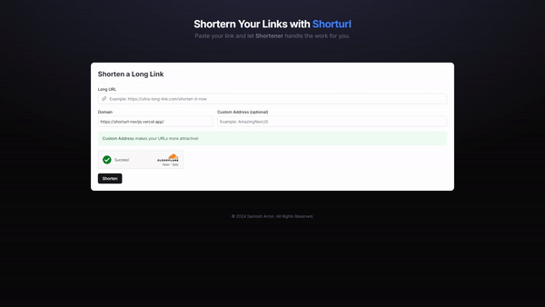

# ShortURL

## Introduction

This repository is a URL Shortener to shorten long URLs like [bit.ly](https://bitly.com/) and similar. Built using [Next.js](https://nextjs.org/) and [MongoDB](https://mongodb.com) as database and secured with [Cloudflare Turnstile](https://www.cloudflare.com/products/turnstile/).

## Demo

To get a quick overview of how the project works, check out the demo below:



## Tech Stack
This project was built using these technologies.
- [Next.js](https://nextjs.org/)
- [MongoDB](https://mongodb.com)
- [TailwindCSS](https://tailwindcss.com)
- [Cloudflare Turnstile](https://www.cloudflare.com/products/turnstile/)

## Installation

To get started with this project, follow the instructions below to set up your development environment.

1. **Clone the repository:**

   ```bash
   git clone https://github.com/santosharron/shorturl-nextjs.git
   ```
   
2. **Install dependencies:**

   ```bash
   npm install
   ```
3. **Setup `.env`**
    ```bash
    MONGODB_URL = "MONGODB_URL"
    NEXT_PUBLIC_SITE_KEY = "CF_TURNSTILE_SITE_KEY"
    SECRET_KEY = "CF_TURNSTILE_SECRET_KEY"
    ```

4. **Start the application:**

   ```bash
   npm run dev
   ```
Web will run on localhost:3000 by default at development mode.

> **Note:** Be sure to use Test keys for Cloudflare when running the project in development.
```bash
NEXT_PUBLIC_SITE_KEY = "1x00000000000000000000AA"
SECRET_KEY = "1x0000000000000000000000000000000AA"
```

## License

This project is licensed under the [MIT License](LICENSE).
